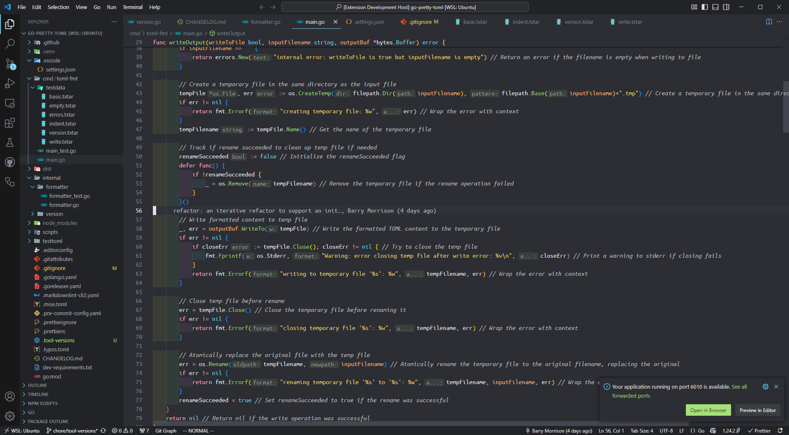
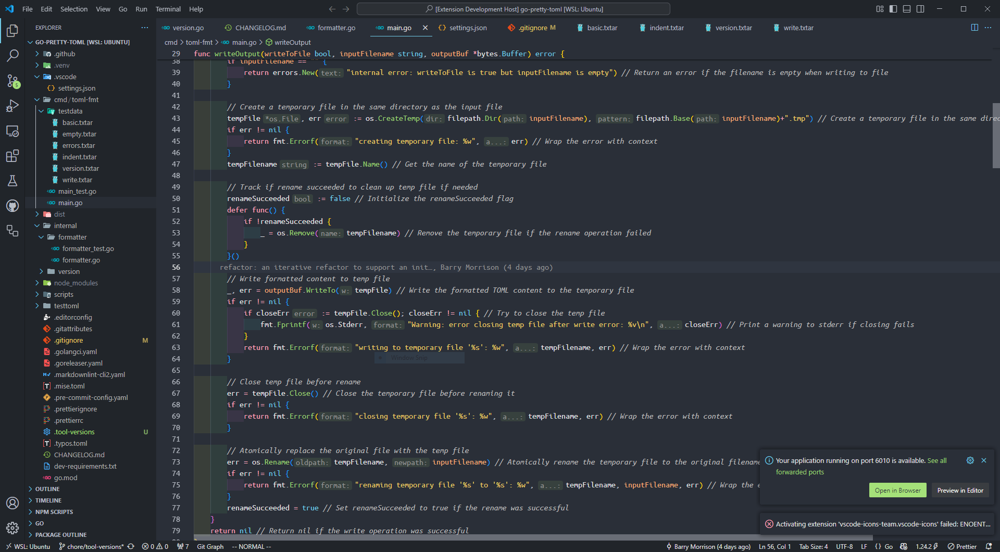
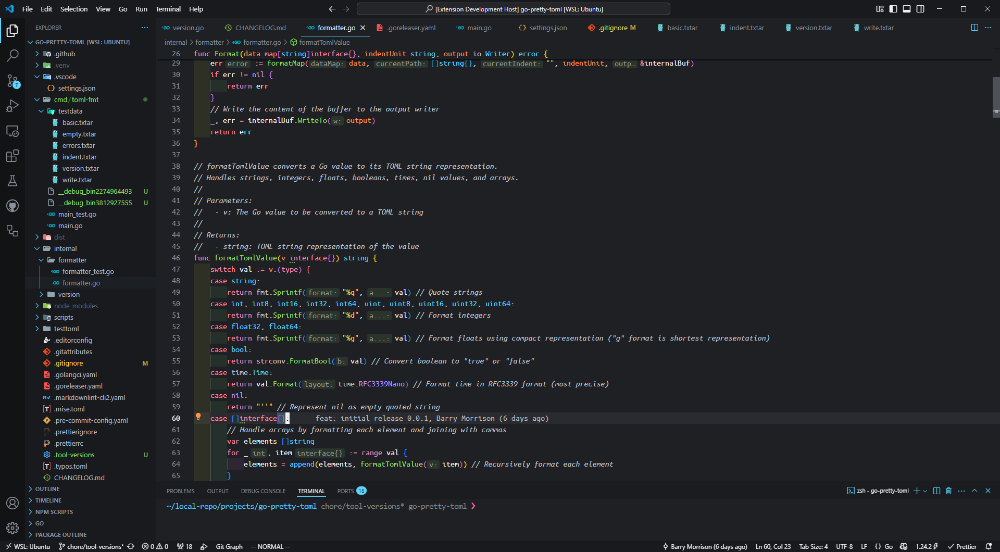

# esacteksab kai

A high-contrast, accessibility-focused VS Code theme inspired by [Sonokai](https://github.com/sainnhe/sonokai-vscode) by sainnhe. This theme meets or exceeds WCAG AA standards and in most cases meets or exceeds AAA contrast standards.

## Default



## Atlantis



## Vivid



## Features

- Meets or exceeds AAA WCAG in most cases
- A few instances where AA-rated exists (inlay Hints in Go and Git ignored files in the side bar)
- Support for Semantic Highlighting

## Installation

Clone the repo, then install with

```bash
code --install-extension esacteksab-kai-0.0.7.vsix
```

## Usage

1. Click the gear button in the lower left corner.
1. Click `Color Theme`.
1. Select esacteksab kai [atlantis|vivid] in the list.

## Development

### Prerequisites

- [VS Code](https://code.visualstudio.com/) with the [Dev Containers](https://marketplace.visualstudio.com/items?itemName=ms-vscode-remote.remote-containers) extension, or Node.js 22+ installed locally
- `npm install` to install dependencies

### Editing a theme

The three theme files live in `themes/`:

| File                                  | Theme    |
| ------------------------------------- | -------- |
| `themes/esacteksab-kai-default.json`  | Default  |
| `themes/esacteksab-kai-atlantis.json` | Atlantis |
| `themes/esacteksab-kai-vivid.json`    | Vivid    |

To preview changes live, press `F5` in VS Code. This opens an **Extension Development Host** window with the modified theme loaded. Changes to the JSON files are picked up immediately — no restart needed.

### Releasing a new version

1. **Edit the theme JSON files** with your changes.

1. **Bump the version** in `package.json` following [semver](https://semver.org/):

   ```bash
   npm version patch   # 0.0.5 → 0.0.6 (bug fix / color tweak)
   npm version minor   # 0.0.5 → 0.1.0 (new theme variant)
   npm version major   # 0.0.5 → 1.0.0 (breaking change)
   ```

1. **Update `CHANGELOG.md`** with a summary of what changed.

1. **Validate the theme files** are well-formed:

   ```bash
   npm run validate:themes
   ```

1. **Package the extension**:

   ```bash
   npx vsce package
   ```

   This produces a `.vsix` file (e.g. `esacteksab-kai-0.0.6.vsix`).

1. **Test the package** by installing it locally:

   ```bash
   code --install-extension esacteksab-kai-<version>.vsix
   ```

1. **Commit and push** — the `Validate Extension` CI workflow will verify the package builds cleanly on every push and PR.

## License

[MIT License](https://github.com/esacteksab/kai-vscode/blob/main/LICENSE) © esacteksab
