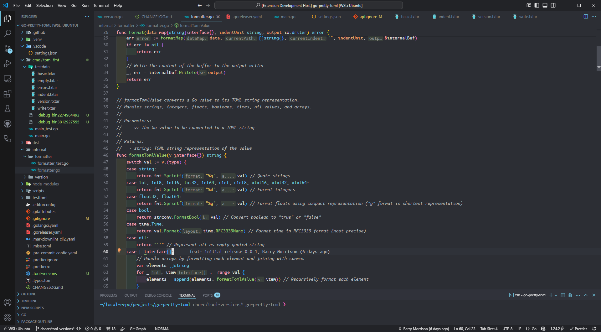
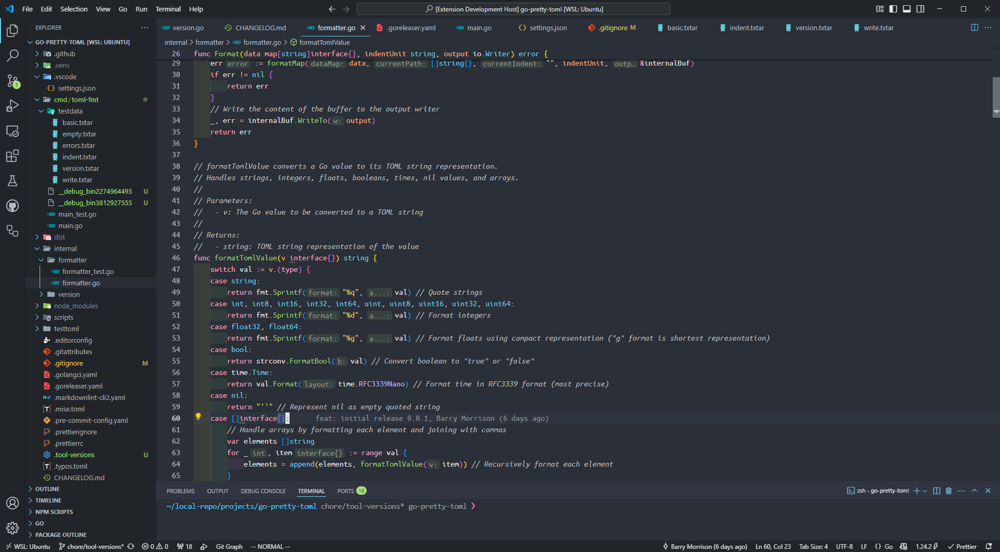

# esacteksab kai

A high-contrast, accessibility-focused VS Code theme inspired by [Sonokai](https://github.com/sainnhe/sonokai-vscode) by sainnhe. This theme meets or exceeds WCAG AA standards and in most cases meets or exceeds AAA contrast standards.

## Default



## Atlantis



## Vivid


## Features

- Meets or exceeds AAA WCAG in most cases
- A few instances where AA-rated exists (inlay Hints in Go and Git ignored files in the side bar)
- Support for Semantic Highlighting
- Rich support for common file types.

## Installation

Clone the repo, then install with 

```bash
code --install-extension esacteksab-kai-0.0.6.vsix
```

## Usage

1. Click the gear button in the lower left corner.
2. Click `Color Theme`.
3. Select esacteksab kai [atlantis|vivid] in the list.


## License

[MIT License](https://github.com/esacteksab/kai-vscode/blob/main/LICENSE) © esacteksab
